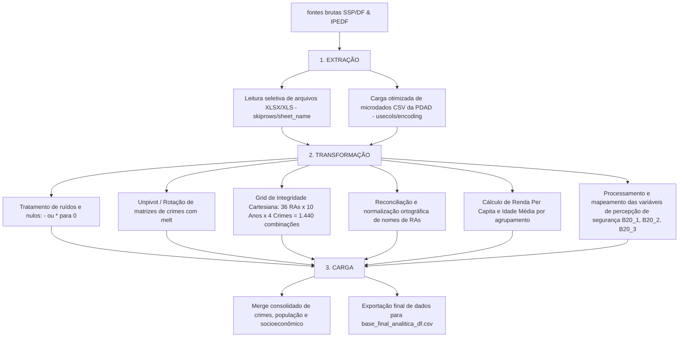

# Dashboard Analítico CVLI Distrito Federal (2015-2024)

Este projeto foi desenvolvido para analisar a evolução temporal e a distribuição regional dos Crimes Violentos Letais Intencionais (CVLI) no Distrito Federal de 2015 a 2024. O sistema integra um pipeline de **Engenharia de Dados (ETL)**, um modelo de **Machine Learning (K-Means Clustering)** para segmentação inteligente de RAs por criticidade, e um **Dashboard Web** responsivo e interativo (HTML/CSS/JS com Leaflet.js e Chart.js).

O repositório foi enriquecido com os microdados socioeconômicos oficiais da **Pesquisa Distrital por Amostra de Domicílios (PDAD 2021)** para correlacionar indicadores demográficos (Renda Per Capita e Idade Média) com os índices de violência por RA.

---

## 📂 Estrutura Organizacional do Projeto

O projeto está estruturado de forma limpa e modular:

```text
CVLI_DF/
├── sources/                     # Arquivos brutos de origem (Excel e CSV)
│   ├── tabelasseriehistorica-homicidio.xlsx
│   ├── tabelasseriehistorica-latrocinio.xlsx
│   ├── tabelasseriehistorica-lcsm.xlsx
│   ├── tabelasseriehistorica-feminicidio.xlsx
│   ├── PDAD_2021-Domicilios.csv # Microdados de Domicílios (IPEDF)
│   └── PDAD_2021-Moradores.csv  # Microdados de Moradores (IPEDF)
│
├── scripts/                     # Inteligência de dados
│   ├── etl.py                   # Pipeline de ETL (Limpeza, Unpivot, Joins com População e PDAD)
│   └── ml_clustering.py         # Modelo de K-Means para agrupamento de RAs por risco
│
├── src/                         # Código-fonte da aplicação web
│   ├── index.html               # Estrutura HTML do painel e aba do mapa
│   ├── style.css                # Estilização visual (Tema Escuro / Glassmorphism)
│   ├── app.js                   # Lógica JS reativa (PapaParse, Leaflet e Chart.js)
│   ├── base_final_analitica_df.csv # Base enriquecida final: Crimes + População + Socioeconômico
│   ├── dados_cvli_df_clusters.csv # Classificações de risco geradas pelo K-Means
│   └── dados_cvli_df_tratados.csv # Cópia para retrocompatibilidade
│
├── run.py                       # Launcher automatizado com auto-bootstrapping
├── RELATORIO_METODOLOGIA.md     # Relatório metodológico científico para defesa acadêmica
└── requirements.txt             # Dependências Python (pandas, scikit-learn, etc.)
```

---

## 🛠️ Tecnologias Utilizadas

O desenvolvimento do projeto é baseado em tecnologias eficientes para processamento de dados e visualização web interativa:

* **Processamento de Dados (Python & Pipelines):**
  * **Python 3**: Linguagem base do ecossistema de dados.
  * **Pandas**: Biblioteca principal para Engenharia de Dados (ETL), utilizada para filtragem, fusão (`merge`), agregação (`groupby`/`agg`), rotação (`melt`) e normalização de tabelas.
  * **NumPy**: Manipulação eficiente de vetores numéricos e tratamento de valores nulos estatísticos (`NaN`).
  * **openpyxl & xlrd**: Motores de decodificação para leitura dinâmica de arquivos do Excel (`.xlsx` e `.xls`).
  * **Scikit-Learn**: Biblioteca de Machine Learning utilizada para escalonamento (`StandardScaler`) e modelagem de clusterização (`KMeans`).
* **Visualização e Frontend Web:**
  * **HTML5 & Vanilla CSS**: Estrutura e estilização premium baseada em conceitos modernos de *Glassmorphism*, paletas de cores harmônicas em HSL e responsividade completa.
  * **JavaScript (ES6+)**: Lógica reativa para manipulação segura de elementos DOM (prevenção contra ataques XSS usando injeção textual).
  * **Leaflet.js**: Renderização e manipulação do mapa geográfico interativo do Distrito Federal.
  * **Chart.js**: Renderização dos gráficos de linha temporal, pizza/rosca e barras.
  * **PapaParse**: Biblioteca de alto desempenho para decodificação e processamento assíncrono direto de arquivos CSV gigantes na web.

---

## 🔄 Fluxo de Engenharia de Dados (ETL)

O pipeline implementado em `scripts/etl.py` realiza o processamento ponta a ponta dos dados desde a sua extração em estado bruto até a carga em base de dados analítica.

O fluxo de dados segue as seguintes etapas:



### Detalhamento das Etapas do Fluxo:

1. **Extração (Extract):**
   * **Dados de Crimes (SSP/DF):** Extrai o histórico de Homicídios, Latrocínios, Lesões Corporais Seguidas de Morte e Feminicídios diretamente das abas e planilhas XLSX brutas, pulando linhas de metadados administrativos (`skiprows`).
   * **Dados de População (SSP/DF):** Extração da projeção populacional das RAs a partir da aba dedicada de população da planilha do Feminicídio.
   * **Dados Socioeconômicos (PDAD 2021):** Carga sob demanda com baixo consumo de memória (`usecols`) dos arquivos `PDAD_2021-Domicilios.csv` (renda e segurança) e `PDAD_2021-Moradores.csv` (idade), e leitura dinâmica do dicionário de mapeamento oficial (`dicionario_de_variaveis_pdad_2021.xls`).

2. **Transformação (Transform):**
   * **Sanitização de Dados:** Remoção de agregados estáticos (como a linha totalizadora do "Distrito Federal" para evitar duplicação em somas) e caracteres especiais.
   * **Normalização de Layout (Tidy Data):** O arquivo de crimes original possui o ano nas colunas. O script aplica a técnica de **unpivot** (`melt`) para criar um formato longo (ano em linha), facilitando a agregação analítica no dashboard.
   * **Grid Cartesiano:** Criação de um grid com todas as combinações teoricamente possíveis de RAs, anos e tipos de crimes para preenchimento de vazios estatísticos com zero. Isso garante 1.440 observações estruturadas e remove "buracos" gráficos na série histórica das RAs seguras.
   * **Agregações Estatísticas da PDAD:**
     * Cálculo da renda média domiciliar per capita e idade média por RA.
     * Mapeamento de respostas às perguntas de segurança: `B20_1` (Policiamento militar), `B20_2` (Segurança privada) e `B20_3` (Segurança comunitária). Respostas afirmativas são mapeadas para `100.0` e negativas para `0.0`, de forma a obter o percentual direto de prevalência de cada infraestrutura no agrupamento das RAs (ignorando respostas do tipo "Não sabe").
   * **Reconciliação e Join:** Normalização de inconsistências textuais de nomes de RAs entre fontes (ex: `Plano Piloto` reconciliado para `Brasília (Plano Piloto)`), seguido de cruzamento final das tabelas (`pd.merge`).

3. **Carga (Load):**
   * Consolidação das colunas e gravação dos arquivos CSV estruturados finais `/src/base_final_analitica_df.csv` e fallback `/src/dados_cvli_df_tratados.csv` usando a codificação `utf-8-sig` para garantir compatibilidade multiplataforma (incluindo Excel e editores locais).

---

## 📊 A Nova Base Analítica (`base_final_analitica_df.csv`)

O arquivo final analítico gerado unifica três fontes de dados distintas:
1. **Dados Criminológicos (SSP/DF):** Quantidade anual de vítimas de Homicídio, Latrocínio, Lesão Corporal Seguida de Morte e Feminicídio por RA (2015-2024).
2. **Dados Demográficos (PDAD/IBGE):** População total de 2024 de cada Região Administrativa para cálculo de taxas.
3. **Dados Socioeconômicos e de Segurança (PDAD 2021):**
   * **Renda_Per_Capita:** Renda domiciliar média por pessoa da RA obtida a partir da amostra expandida de domicílios da PDAD 2021.
   * **Idade_Media:** Idade média da população residente na RA obtida a partir da amostra expandida de moradores.
   * **Policiamento_Militar_Perc:** Percentual de domicílios que declaram ter policiamento militar regular nas proximidades da residência.
   * **Seguranca_Privada_Perc:** Percentual de domicílios equipados com serviços ou dispositivos particulares de segurança (ex: câmeras, alarmes).
   * **Seguranca_Comunitaria_Perc:** Percentual de domicílios que participam ou compartilham sistemas/redes de segurança comunitária com a vizinhança.

*Nota: Regiões criadas após a pesquisa (Arapoanga, Água Quente) e áreas de contagem especial (Unidades Prisionais) exibem esses indicadores socioeconômicos e de segurança como `NaN` na tabela (mostrados no dashboard como `"N/A"`).*

---

## 🔗 Fontes de Dados

Os dados utilizados neste projeto foram obtidos de portais oficiais do Governo do Distrito Federal:

1. **Dados Socioeconômicos e Demográficos (PDAD 2021):**
   * Instituto de Pesquisa e Estatística do Distrito Federal (IPEDF).
   * Microdados de Domicílios e Moradores da Pesquisa Distrital por Amostra de Domicílios.
   * Fonte: [IPEDF - PDAD 2021](https://ipe.df.gov.br/pdad-2021-3)

2. **Dados Criminológicos (Série Histórica de Segurança Pública):**
   * Secretaria de Estado de Segurança Pública do Distrito Federal (SSP/DF).
   * Estatísticas de Crimes Violentos Letais Intencionais (CVLI) e Feminicídios por Região Administrativa.
   * Fonte: [Portal de Dados Abertos do DF - Segurança Pública](https://www.dados.df.gov.br/dataset?q=SEGURAN%C3%87A&sort=title_string+asc)

---

## 🧠 Por que utilizar o Algoritmo K-Means?

A escolha do **K-Means Clustering** (Aprendizado de Máquina Não Supervisionado) para a segmentação de risco das RAs justifica-se pelos seguintes fatores metodológicos e estatísticos:

1. **Eliminação de Vieses e Subjetividade Humana:**
   Em vez de definir arbitrariamente limites de criminalidade (por exemplo, decidir manualmente que "mais de 10 homicídios por ano é alto risco"), o algoritmo encontra naturalmente agrupamentos de RAs com perfis semelhantes com base estritamente na distribuição estatística dos dados reais.

2. **Análise Multidimensional:**
   O K-Means avalia a similaridade considerando simultaneamente quatro variáveis críticas: as taxas de Homicídio, Latrocínio, Lesão Corporal Seguida de Morte (LCSM) e Feminicídio por 100 mil habitantes. Uma análise visual humana de tantas dimensões cruzadas simultaneamente seria extremamente complexa e imprecisa.

3. **Independência de Escala (StandardScaler):**
   Como as taxas de homicídios costumam ter magnitudes numéricas muito superiores às taxas de feminicídios, aplicamos a padronização das características. Isso garante que todos os tipos de crimes tenham o mesmo peso no cálculo das distâncias euclidianas do algoritmo, impedindo que uma variável dominante oculte as outras.

4. **Classificação Semântica e Determinística:**
   Embora o K-Means por si só gere grupos de forma não ordenada (onde os clusters 0, 1 e 2 não têm significado de ordenação inerente), nosso pipeline analisa os centroides resultantes e ordena os IDs de forma determinística com base na soma das taxas de crimes. Isso assegura que o ID 0 sempre representará o **Baixo Risco**, o ID 1 o **Médio Risco** e o ID 2 o **Alto Risco**, permitindo uma colorização consistente e automatizada no dashboard.

---

## 🚀 Como Iniciar o Dashboard (Execução Rápida)

Você **não precisa instalar nenhuma biblioteca adicional do Python** se desejar apenas visualizar o dashboard! Ele funciona imediatamente usando os dados analíticos pré-processados que estão na pasta `/src`.

1. **Iniciar a Aplicação:**
   Execute o comando abaixo no terminal da raiz do projeto:
   ```bash
   python3 run.py
   ```
   *O inicializador verificará os arquivos de dados locais, iniciará um servidor web seguro em `127.0.0.1:8000` e abrirá a página no seu navegador padrão automaticamente!*

2. **Acesso Manual (Se necessário):**
   Navegue para:
   👉 **[http://127.0.0.1:8000](http://127.0.0.1:8000)**

---

## ⚙️ Reprocessar Dados e Machine Learning (Opcional)

Caso queira atualizar as planilhas do diretório `/sources` e rodar a engenharia de dados/IA novamente:

1. **Criar e Ativar Ambiente Virtual:**
   ```bash
   python3 -m venv .venv
   source .venv/bin/activate
   ```

2. **Instalar Dependências:**
   ```bash
   pip install -r requirements.txt
   ```

3. **Rodar de Forma Unificada:**
   Se você deletar os arquivos `.csv` de `/src`, basta executar:
   ```bash
   python3 run.py
   ```
   *O script `run.py` detectará a ausência dos dados e executará os pipelines `scripts/etl.py` e `scripts/ml_clustering.py` automaticamente antes de subir o servidor!*
